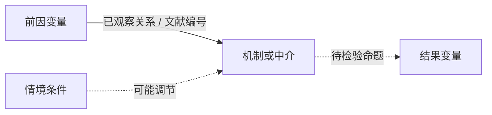
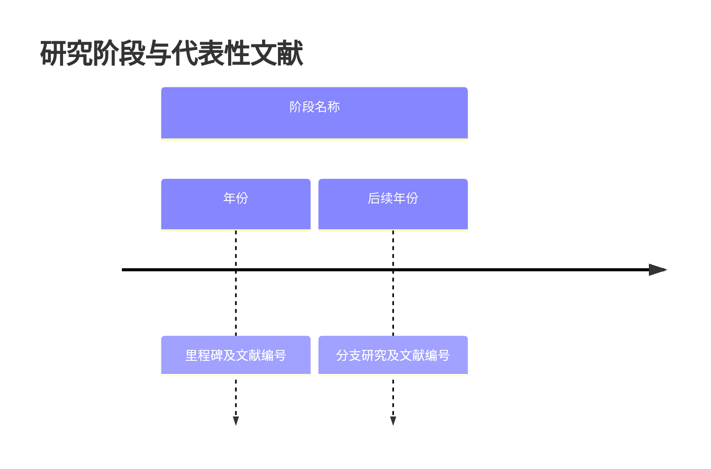

# 理论框架图与时间线模板

替换节点、年份和证据编号。定义实线和虚线在当前研究中的含义，在图后交代每个关键箭头的预期关系、证据来源及适用条件。时间线阶段根据纳入资料的时间和范式变化命名。〔模板依据：[交付契约](../SKILL.md#交付契约)〕

```mermaid
flowchart LR
    X["前因变量"] -->|"已观察关系 / 文献编号"| M["机制或中介"]
    M -.->|"待检验命题"| Y["结果变量"]
    C["情境条件"] -.->|"可能调节"| M
```

```mermaid
timeline
    title 研究阶段与代表性文献
    section 阶段名称
        年份 : 里程碑及文献编号
        后续年份 : 分支研究及文献编号
```
